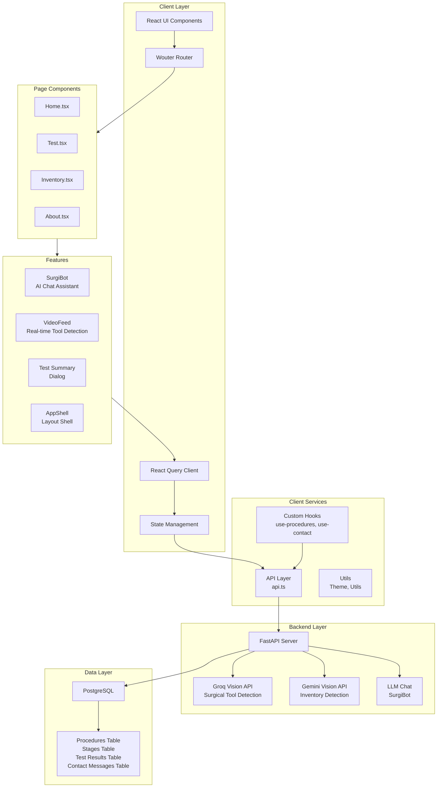
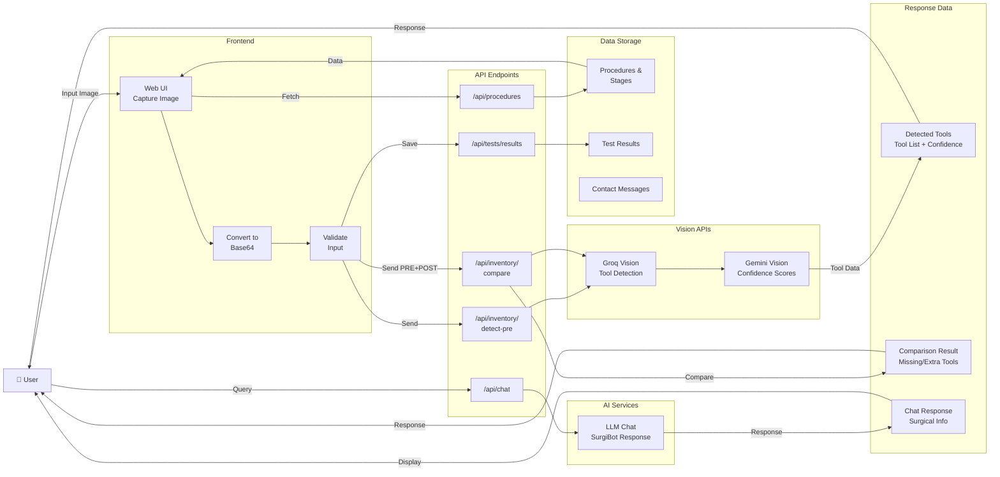
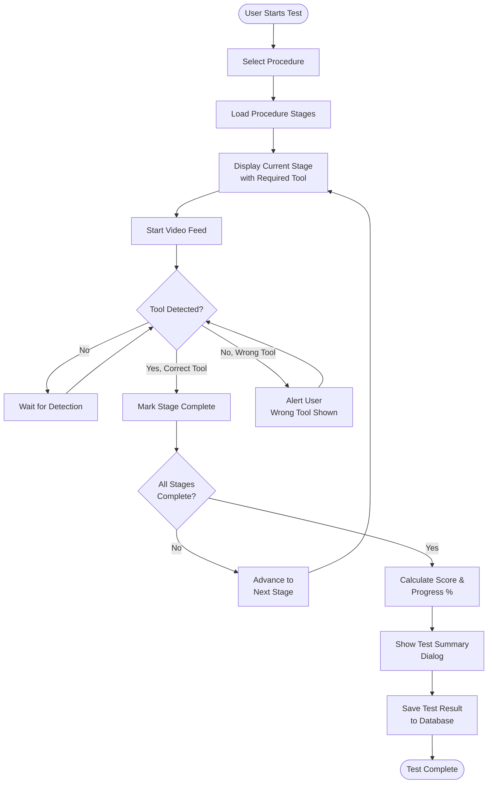
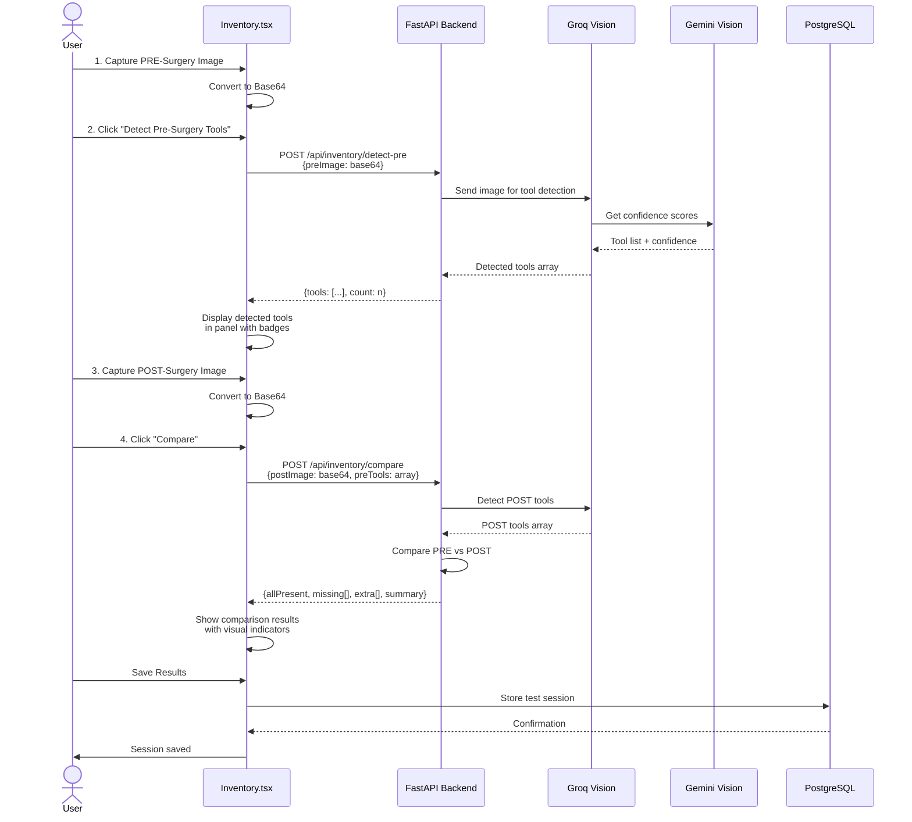
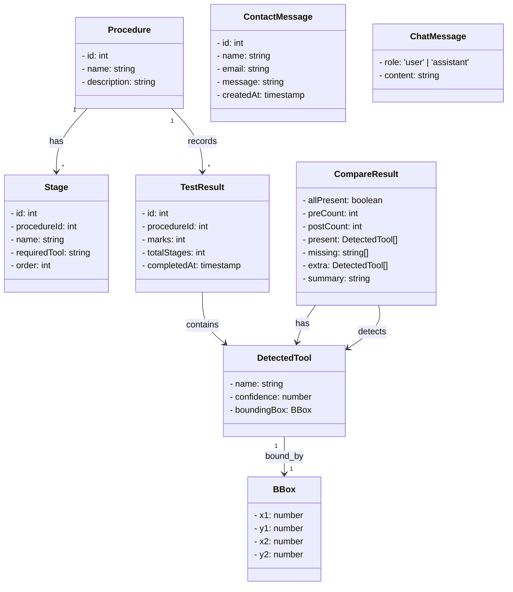

# SurgiTrack - All Diagrams (Mermaid Code)

All diagrams below are in Mermaid syntax. Render them using:
- GitHub markdown
- Mermaid.live editor
- VS Code extensions
- Any Mermaid-compatible tool

---

## 1. ARCHITECTURE DIAGRAM

---

## 2. DATA FLOW DIAGRAM

---

## 3. ACTIVITY DIAGRAM

---

## 4. SEQUENCE DIAGRAM

---

## 5. CLASS DIAGRAM

---

## How to Use

### Option 1: GitHub/GitLab
Commit this file to repo - diagrams auto-render

### Option 2: Mermaid Live Editor
Visit https://mermaid.live and paste any diagram code

### Option 3: VS Code
Install "Markdown Preview Mermaid Support" extension

### Option 4: Export as PNG/SVG
Use https://kroki.io to convert Mermaid to images

### Option 5: Embed in Tools
- Notion, Confluence, GitHub Wiki support Mermaid natively
